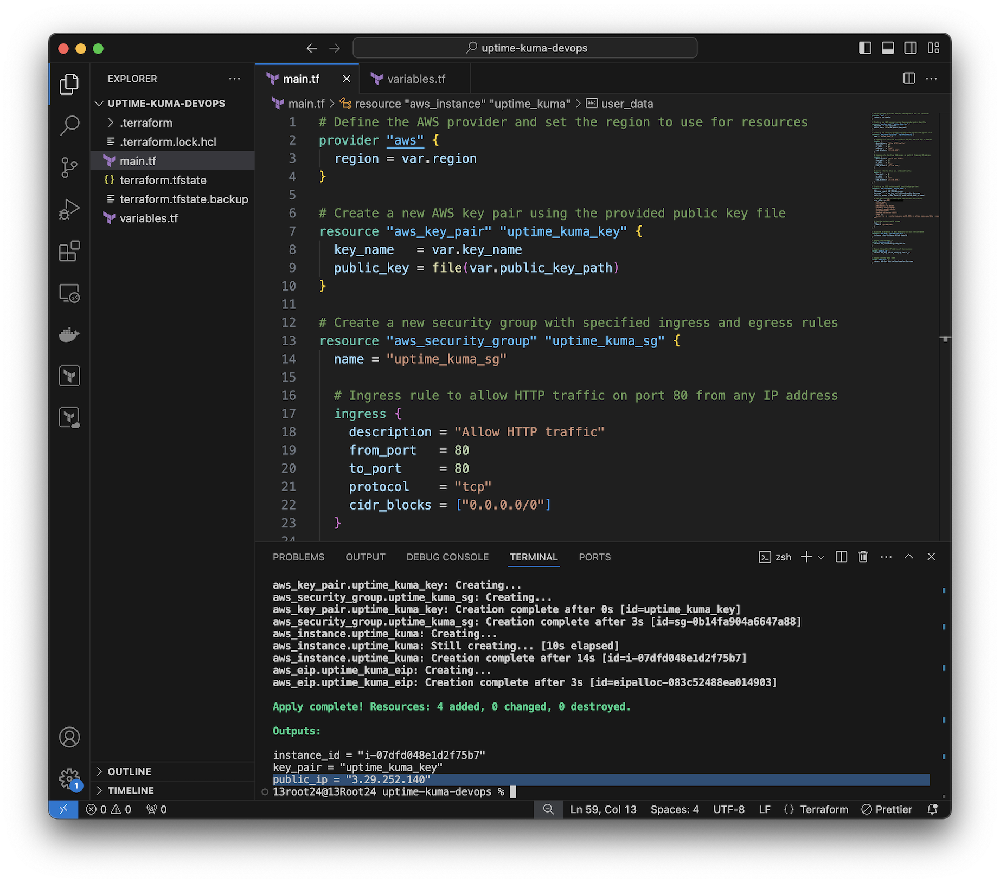
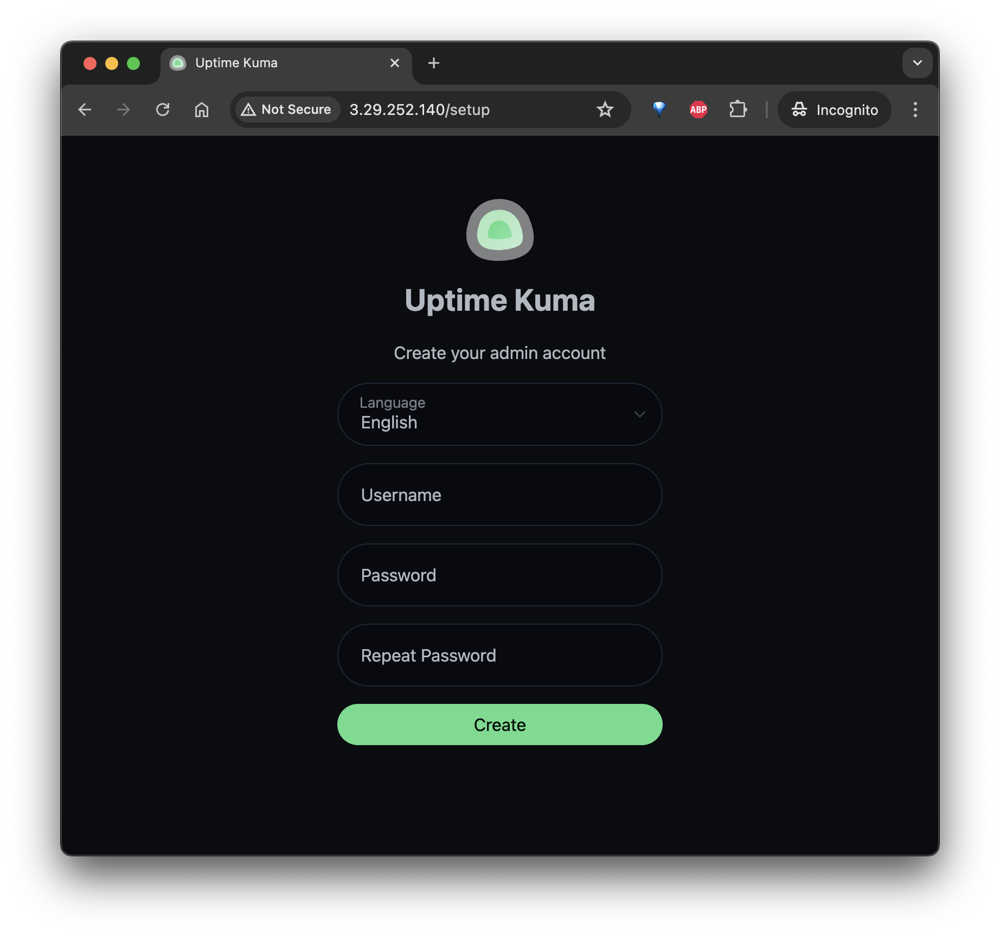

# Uptime Kuma Deployment in less than 30 seconds!

This repository contains Terraform configurations to deploy a virtual machine instance running [Uptime Kuma](https://github.com/louislam/uptime-kuma), a self-hosted monitoring tool, on any cloud provider. The deployment script also installs Docker and runs the Uptime Kuma Docker container.

## What is Terraform?

[Terraform](https://www.terraform.io/) is an open-source `infrastructure as a code` software tool created by HashiCorp. It allows users to define and provision datacenter infrastructure using a high-level configuration language known as HashiCorp Configuration Language (HCL), or optionally JSON. Terraform manages external resources (such as public cloud infrastructure, private cloud infrastructure, network appliances, and software as a service) with a "provider" model, supporting multiple providers such as AWS, Azure, Google Cloud, and others.

## Prerequisites

- [Terraform](https://www.terraform.io/downloads.html) installed
- Cloud provider CLI configured with appropriate permissions (e.g., AWS CLI, Azure CLI, Google Cloud SDK)

## Usage

1. **Clone the repository:**
   ```sh
   git clone https://github.com/your-username/uptime-kuma-terraform.git
   cd uptime-kuma-terraform
   ```

2. **Initialize Terraform:**
   ```sh
   terraform init
   ```

3. **Validate the configuration:**
   ```sh
   terraform validate
   ```

4. **Plan the deployment:**
   ```sh
   terraform plan
   ```

5. **Apply the configuration:**
   ```sh
   terraform apply
   ```
   Confirm the apply action when prompted.

Now your server is up and running, just wait a few seconds to finish initializing, then you can access the Uptime Kuma dashboard by navigating to the public IP address which is printed in the terminal after the deployment is finished.

## Screenshots




**Destroy the configuration if needed:**
   ```sh
   # use this to revert back if you want to switch down what you applied!
   terraform destroy
   ```

## License

This project is licensed under the MIT License. 

## Acknowledgments

- [Uptime Kuma](https://github.com/louislam/uptime-kuma)
- [Terraform](https://www.terraform.io/)
